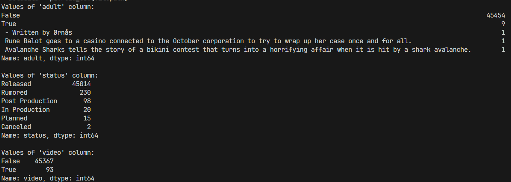

# moviesDataAnalysis
对kaggle上的电影数据集进行特征分析和特征融合

# 数据集结构
- credits.csv
	- cast：主演和配角的名字
	- crew：导演、编辑、作曲家、作家等姓名。
	- id：每部电影的唯一标识符
- movies_metadata.csv
	- adult：是否是成人片
	- belongs_to_collection：电影所属的系列
		- 包括id(系列id)、name系列名、海报URL、背景图URL
	- budget：经费
	- genre：电影类型
	- gomepage：到电影主页的URL链接
	- id：电影id，对应credits.csv
	- imdb_id：与imdb对应的id（没用）
	- original_language：电影制作语言
	- original_title：翻译前的原标题
	- overview：电影简介
	- popularity：流行度，用数字量化了（可以用来推荐，历史热门电影）
	- poster_path：电影海报URL
	- production_companies：制片公司
	- production_countries：制片国
	- release_date：发布日期
	- revenue：收入
	- runtime：电影时长
	- spoken_language：播放语言
	- status：状态
		- released or rumored?
		- 待分析
	- tagline：电影标语
	- title：电影名
	- video：是否有视频流？没看太懂
	- vote_average：平均分
	- vote_count：打分人数
- keywords.csv
	- id：电影id
	- keywords：
		- id：用户id
		- name：用户对电影的关键词（可能还需要一个情感分析？）
- links.csv（这个数据集应该没用）
	- 电影id、imdbId、tmdbId的映射关系
- ratings.csv
	- userId：用户ID
	- movieId：电影ID
	- rating：用户对该电影的评分
	- timestamp：时间戳，用户打分的时间

# 分析需求
- 各数据集缺省值、异常值
	- movues_metadata.csv数据集
		- belongs_to_collection、homepage、tagline缺省值占比值较高，分别达到了90.11%，82.88%，55.10%，准备进行数据清洗，将这几个字段删去。其他字段虽然也有缺省值，但是基本都在零左右徘徊，除了overview字段有2%的缺省值，总之影响不大。	
- 查看一些字段的取值情况
	- 查看一些值的取值情况
	- movies_metadata.csv
		- adults
			- False 45454
			- True 9
			- 异常值 3（感觉是别的字段混进来了）
		- status
			- Released 45014
			- Rumored 230
			- Post Production 98
			- In Production 20
			- Planned 15
			- Canceled 2
		- video
			- False 45367
			- True 93
		- 
			- 可以看出这三个字段的数据，其值差异很大，对最后的推荐影响微乎其微，可以video、adults考虑清洗，status可以合并到最后的数据集中，做一个信息的展示
		- 绘制电影时长直方图
			- 数据基本上集中在 80-120 这个区间里，两端少，可以根据时长来进行推荐
		- 绘制不同语言电影数量直方图
			- 英语最多 32254，其他就比较少 几千几百这样，可以把语言加入用户的观影习惯，以此推荐
- 找找哪些特征可以融合
	- 把处理过后的credits数据集中的演员、饰演角色和导演字段融合到movies数据集中

# 处理之后的数据集
- metadata
	- metadata数据集中需要保留的字段
		- **budget**、**genres（已处理）**、**id**、original_language、original_title、overview、popularity、production_companies（已处理）、production_countries（已处理）、release_date、revenue、runtime、spoken_languages（已处理）、status、title、**vote_average**、vote_count
		- 删除的字段有belongs_to_collection、homepage、tagline、video、adults、imdb_id
		- 还需要使用，但是提取出来的有poster_path
- credits
	- 已处理：cast、crew
- keywords
	- 已处理：keywords
- 处理时因为这些字段的属性在原数据集中是以json格式呈现的，为了方便后续数据库的读写，我就做成了以'|'分隔多个值的格式